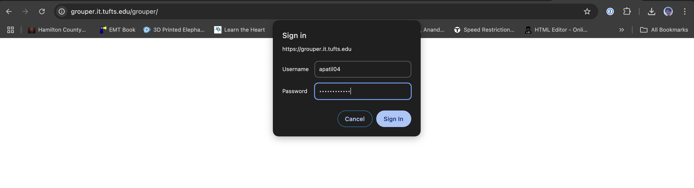
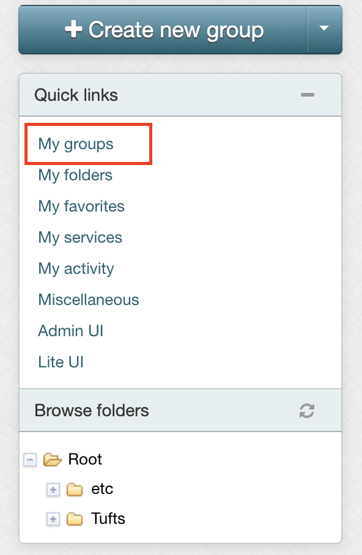
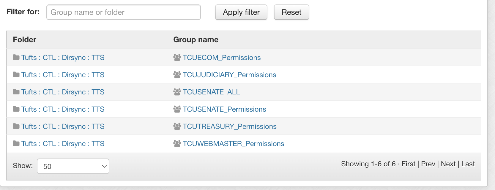

# Access to Shared Inboxes & Internal Distribution Lists

The Tufts Community Union government utilizes multiple internal distribution lists and shared inboxes.

## Shared Inboxes

In order to maximize the transparency and accessibility for the student body as well as ease-of-use for the TCU Government:

- Shared inboxes should be the main point of communication and point of contact for all government operations.

- No alternative emails such as Gmail accounts should ever be created or used.

- Shared inboxes should be consistently checked. Replies should originate from the shared inbox account.

- Whenever not being checked, shared inboxes should have out of office notifications.

#### Importance of Using Shared Inboxes

Shared inboxes are a key tool for the TCU for everyday tasks. They help students communicate with their elected representatives using Tufts-owned & Tufts-managed platforms; having Tufts-integrated points of communication are especially important for transparency and accessibility purposes. For example, students may not have instagram nor trust emailing a random gmail account. For these reasons, communication with the student body should mainly take place on these shared inbox accounts (supplemented by checking Instagram DMs and other applicable areas). No email platform (like Gmail) should ever be used for email communication. Gmail also uses passwords instead of Tufts account integrated access; historically, they have been hard to transition properly across terms and often get lost and unused.

#### Successfully Using Shared Inboxes

Shared inboxes should be advertised on the website and in all Instagram bios. Whenever students need to contact the TCU with information, the designated shared inbox should always be used. For example, ECOM should always use their inbox to answer students' questions regarding elections and communicate with candidates using these inboxes. Additionally, these inboxes must be checked frequently by multiple individuals. Replies should originate from the shared inbox, except in special circumstances. Out of office replies should always be enabled when inboxes are not being checked.

### List of Inboxes

| Inbox Name                       | Alias                             | Access Link                                                       | Grouper Permission Group | Membership                   |
| -------------------------------- | --------------------------------- | ----------------------------------------------------------------- | ------------------------ | ---------------------------- |
| TCUElectionsCommission@tufts.edu | TCUECOM@tufts.edu, ecom@tufts.edu | https://outlook.office.com/mail/TCUElectionsCommission@tufts.edu/ | TCUECOM_Permissions      | All of ECOM                  |
| TCUJudiciary@tufts.edu           | TCUJ@tufts.edu                    | https://outlook.office.com/mail/TCUJudiciary@tufts.edu/           | TCUJUDICIARY_Permissions | All of Judiciary             |
| TCUSenate@tufts.edu              | N/A                               | https://outlook.office.com/mail/TCUSenate@tufts.edu/              | TCUSENATE_Permissions    | Senate Exec + Chair Outreach |
| TCUTreasury@tufts.edu            | N/A                               | https://outlook.office.com/mail/TCUTreasury@tufts.edu/            | TCUTREASURY_Permissions  | Treasurers                   |
| TCUWebmaster@tufts.edu           | N/A                               | https://outlook.office.com/mail/TCUWebmaster@tufts.edu/           | TCUWEBMASTER_Permissions | Webmaster + OCL + Chair CSL  |

_not case sensitive_

### Accessing Inboxes

Inboxes can be accessed by the following:

##### Website:

1. Log in to your normal Tufts [Outlook](https://outlook.office.com/mail/)

2. Press your icon picture in the top right corner

3. Press "Open another mailbox"

4. Type in the shared inbox's email address into the box

5. Press "Open"

[VIDEO TUTORIAL](https://tufts.box.com/s/5qmfik7nz1xmtbb3atwytvelxk8v4ahp "https://tufts.box.com/s/5qmfik7nz1xmtbb3atwytvelxk8v4ahp")

##### MacOS:

1. Press "File" > "Open" > Shared Mailbox

[VIDEO TUTORIAL](https://tufts.box.com/s/t826rdimdpf6yhh8yaxosqn5msciz6kx "https://tufts.box.com/s/t826rdimdpf6yhh8yaxosqn5msciz6kx")

##### iOS:

1. Press your icon in the top left

2. Press the email with a plus sign on the left side of the screen

3. Press "Add Shared Mailbox"

[VIDEO TUTORIAL](https://tufts.box.com/s/dzwgkzio9xi2ejhmlutm52iec7auyy77 "https://tufts.box.com/s/dzwgkzio9xi2ejhmlutm52iec7auyy77")

## Controlling Access: Grouper

Grouper is a tool used to control access to membership across different systems at Tufts.

### Access Grouper

1. Go to https://grouper.it.tufts.edu

2. Sign in

3. Press `My groups` 

You should now see the groups:

### Description of Grouper Groups

| Grouper Name             | Purpose                                                                                | Membership                   |
| ------------------------ | -------------------------------------------------------------------------------------- | ---------------------------- |
| TCUECOM_Permissions      | Control access to ECOM's shared inbox & membership of J's distribution list            | All of ECOM                  |
| TCUJUDICIARY_Permissions | Control access to J's shared inbox & membership of J's distribution list               | All of Judiciary             |
| TCUSENATE_ALL            | Control membership of Senate's distribution list                                       | All of Senate                |
| TCUSENATE_Permissions    | Control access to Senate's shared inbox                                                | Senate Exec + Chair Outreach |
| TCUTREASURY_Permissions  | Control access to Treasury's shared inbox                                              | Treasurers                   |
| TCUWEBMASTER_Permissions | Control access to Webmaster's shared inbox & designate ownership of all Grouper groups | Webmaster + OCL + Chair CSL  |

### Managing Grouper Membership

Grouper membership utilizes UTLNs.
